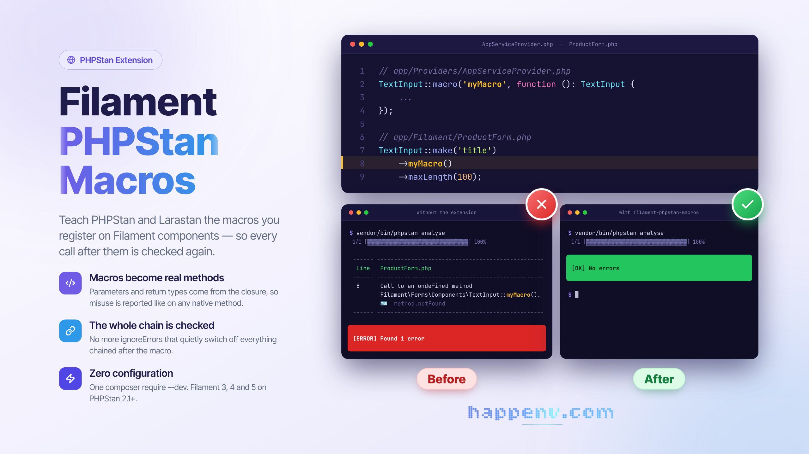

# Filament PHPStan Macros

<div class="filament-hidden">



</div>

[](https://github.com/happenv-com/filament-phpstan-macros/releases)
[](https://github.com/happenv-com/filament-phpstan-macros/actions/workflows/tests.yml)
[](https://github.com/happenv-com/filament-phpstan-macros/actions/workflows/phpstan.yml)
[](https://github.com/happenv-com/filament-phpstan-macros/actions/workflows/quality.yml)
[](https://packagist.org/packages/happenv-com/filament-phpstan-macros)
[](https://github.com/happenv-com/filament-phpstan-macros/blob/1.x/LICENSE.md)

A PHPStan extension that makes [PHPStan](https://phpstan.org) and [Larastan](https://github.com/larastan/larastan) understand **macros registered on Filament components** — `TextInput`, `TextColumn`, `TextEntry`, `Grid`, `Action` and everything else built on Filament's `Macroable`.

Filament ships its own macro trait, `Filament\Support\Concerns\Macroable`, instead of Laravel's `Illuminate\Support\Traits\Macroable`. Larastan only knows Laravel's trait, so every Filament macro call is an "undefined method" — and, as shown below, ignoring that error switches off analysis of everything chained after the macro.

```php
// A service provider
Field::macro('translatableLabel', function (string $key): Field {
    /** @var Field $this */
    return $this->label(__("fields.{$key}"));
});

// Anywhere in the app
TextInput::make('title')->translatableLabel('title')->maxLength(100);
```

### Why it matters: everything after the macro goes dark

Without this package PHPStan reports every macro call as `Call to an undefined method`. The usual fix is an `ignoreErrors` entry — and that hides far more than the macro: the macro's result is unknown, so **every method chained after it is no longer checked at all**.

```php
TextInput::make('title')
    ->translatableLabel('title')      // the macro — its error is ignored
    ->copyable(copyMessage: 42)       // wrong argument type
    ->maxLenght(100);                 // typo
```

| Analysis (level 8)                                   | Reported                                                                                                      |
|------------------------------------------------------|---------------------------------------------------------------------------------------------------------------|
| without this package, macro error in `ignoreErrors`  | **nothing** — both bugs pass                                                                                  |
| with this package                                    | `Parameter $copyMessage of method TextInput::copyable() expects Closure\|string\|null, 42 given.`<br>`Call to an undefined method TextInput::maxLenght().` |

At level 9 and above the ignored macro only turns into `Cannot call method copyable() on mixed` for every following call — noise that tends to get ignored as well, with the same result. With this package the macro is a typed method, so the whole chain is analysed like any other Filament code.

## Key features

- **The code after a macro is checked again.** No more `ignoreErrors` for macros — which silently switched off analysis of everything chained after them.
- **Macros become real methods for PHPStan.** Parameters and return type are read from the registered closure, so a wrong argument or a misused result is reported like for any native method.
- **Fluent chains keep their type.** A macro typed to return one of the caller's ancestors (e.g. `Field` when called on `TextInput`) returns `static`, so subclass-only methods after it are still known.
- **Filament's own lookup rules.** A macro registered on the class itself wins over one registered on a parent, exactly as Filament resolves it at runtime.
- **Any callable.** Closures, invokable objects and array callables registered with `macro()` or `mixin()` are all understood.
- **Zero configuration.** With `phpstan/extension-installer` the extension registers itself; no Filament dependency is added to your production install.
- **Filament 3, 4 and 5.** Tested against every major on PHP 8.3 – 8.5, with the lowest and the newest installable PHPStan 2.x.

## Requirements

| Package  | Versions  |
|----------|-----------|
| PHP      | 8.3 – 8.5 |
| PHPStan  | 2.1+      |
| Filament | 3, 4, 5   |

Macros are read from Filament at analysis time, so they must be registered when PHPStan runs. [Larastan](https://github.com/larastan/larastan) does that for you: it boots your Laravel application, which runs the service providers that register them.

## Installation

Install the package as a development dependency:

```bash
composer require --dev happenv-com/filament-phpstan-macros
```

With [`phpstan/extension-installer`](https://github.com/phpstan/extension-installer) (Larastan setups usually have it) there is nothing else to do. Otherwise include the extension in your `phpstan.neon`:

```neon
includes:
    - vendor/happenv-com/filament-phpstan-macros/extension.neon
```

## Usage

Register macros as usual — typically in a service provider's `boot()` — and **type the closure**: its parameter and return types are what PHPStan will use.

```php
use Filament\Forms\Components\Field;
use Filament\Forms\Components\TextInput;
use Filament\Tables\Columns\Column;
use Filament\Tables\Columns\TextColumn;

// Fluent: typed to return an ancestor, so the chain keeps the caller's type.
Column::macro('sortableAndSearchable', function (): Column {
    /** @var Column $this */
    return $this->sortable()->searchable();
});

// Returning a value: kept as declared.
Field::macro('translationKey', function (): string {
    /** @var Field $this */
    return "fields.{$this->getName()}";
});

TextColumn::make('name')->sortableAndSearchable()->limit(50); // still a TextColumn: limit() is known
TextInput::make('title')->translationKey();                    // string
```

### Without Larastan

Register the macros before analysis with a [bootstrap file](https://phpstan.org/config-reference#bootstrap):

```neon
parameters:
    bootstrapFiles:
        - phpstan-macros.php   # calls TextInput::macro(...) and friends
```

### Good to know

- A closure without a return type is analysed as returning `mixed`, just like with Larastan's macros — add the return type.
- Macros are exposed as instance methods. Calling a Filament macro statically (`TextInput::myMacro()`) is still reported.
- Only Filament's `Macroable` is handled here; Laravel's `Macroable` (collections, requests, Eloquent builders, …) stays Larastan's job, so both work side by side.

## Development

```bash
composer test     # PHPStan test cases: unit tests and type inference on tests/Types/data
composer phpstan  # static analysis of the package itself (level max)
composer cs       # fix code style: composer normalize, Rector, Pint
composer ci       # everything CI checks, locally
```

The macros the type-inference tests analyse are registered in `tests/bootstrap.php`; add a case there and an `assertType()` to `tests/Types/data/macros.php`.

## Upgrading

Breaking changes and how to migrate are described in [UPGRADING](https://github.com/happenv-com/filament-phpstan-macros/blob/1.x/UPGRADING.md) for every major version.

## Changelog

See [CHANGELOG](https://github.com/happenv-com/filament-phpstan-macros/blob/1.x/CHANGELOG.md) and [GitHub releases](https://github.com/happenv-com/filament-phpstan-macros/releases) for what has changed recently.

## Contributing

See [CONTRIBUTING](https://github.com/happenv-com/filament-phpstan-macros/blob/1.x/.github/CONTRIBUTING.md) for details.

## Security vulnerabilities

Please review [our security policy](https://github.com/happenv-com/filament-phpstan-macros/blob/1.x/.github/SECURITY.md) on how to report security vulnerabilities.

## Credits

- [Happenv sp. z o.o.](https://happenv.com)
- [webard](https://github.com/webard)
- [All contributors](https://github.com/happenv-com/filament-phpstan-macros/contributors)

## License

The MIT License (MIT). See [License File](https://github.com/happenv-com/filament-phpstan-macros/blob/1.x/LICENSE.md) for more information.

---

<p align="center">
    <a href="https://happenv.com">
        
    </a>
</p>
